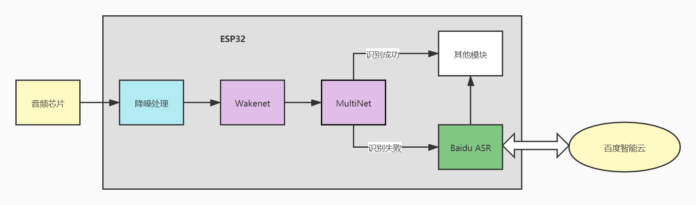
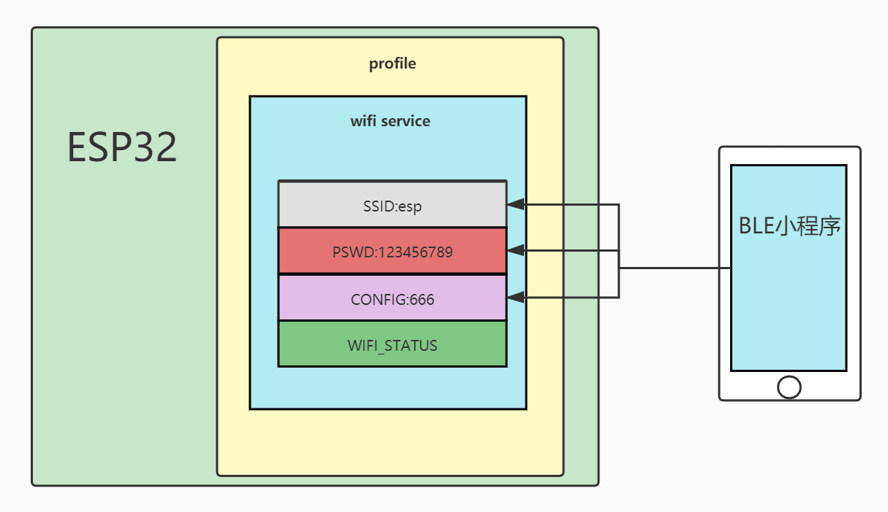

<!--

 * @Author: your name
 * @Date: 2021-03-06 09:55:31
 * @LastEditTime: 2021-09-01 22:24:45
 * @LastEditors: Please set LastEditors
 * @Description: In User Settings Edit
 * @FilePath: \esp-adf\examples\myapp\off_asr\README.md
-->

## 智能遥控器（在线版）

本项目基于esp32a1s模组，设计了一个遥控器，除了实现基本的红外遥控功能，还利用ESP32芯片具备的AI能力，WIFI及蓝牙功能，实现多种方式的输入输出控制，使人们能通过语音，手机远程进行红外遥控。同时又加入温度传感器，并支持将温度数据上传云端，使人们能随时随地查看、分析数据。

## 仓库目录

> doc:说明文档
>
> main：用户代码
>
> > audio:音频代码
> >
> > app:应用代码
> >
> > ir_decoder:红外码库代码
> >
> > network:网络、蓝牙相关代码
> >
> > periph:外设驱动代码
>
> picture：图片
>
> tools：使用到的工具
>
> > mp3:MP3离线音频
> >
> > spiffs：文件系统，存放二进制码库
> >        etymology_anallyze：百度词法分析定制文件
>
> partitions.csv：分区表

### 一、程序框架


### 二、硬件设计

### 三、软件模块

#### 1、语音识别模块

相对于离线版，在线版除了具有本地的语音识别之外，还加入了百度的语音识别API，当本地的语音识别未能匹配到命令时，将音频数据发送到百度语音识别接口，并对返回的文本结果进行解析，逻辑如图（百度智能云语音识别返回结果是utf-8编码的字符串，所以代码编辑器中最好设置utf-8编码.）



- WakeNet是语音唤醒模型
- MultiNet是语音识别模型。
- Baidu ASR是在线识别的任务

语音模块的工作流程如下：

麦克风输入的音频经过音频解码芯片，通过IIS进入到ESP32内存，经过降噪处理输入WakeNet检测是否存在唤醒词，若有唤醒词则进入语音识别，将音频输入MultiNet匹配命令词，同时缓存音频数据。若匹配成功则会执行命令内容，若经过设置的时间（eg 4s）匹配失败，则将缓存的音频数据通过Baidu ASR发送到百度智能云并读取返回的文本结果，对结果解析出命令内容执行。


#### 2、ble

ESP32支持蓝牙双模，目前仅使用蓝牙进行配网（即给esp32发送wifi名称和密码，使esp32连接到wifi）。所以使用ble更合适。

BLE（低功耗蓝牙），适合数据量较小的场合，ESP32支持完整的BLE协议栈，以ESP32作为BLE从机，发送广播、建立GATT Server并等待客户端连接。客户端以微信小程序BLE为例。小程序与ESP32蓝牙通信过程如下图：

ESP32建立一张profile、并创建一个wifi service、用于配置ESP32的wifi。小程序可向wii service 的相应属性中写入数据，来配置ESP32的wifi。

> 如图，向SSID、PSWD、CONFIG分别写入下值，ESP32会自动连接到路由器esp




#### 3、mqtt模块

该模块使用mqtt_client库实现mqtt客户端进程的登陆，订阅，发布等功能。MQTT broker则使用华为云的设备接入IOT平台。

华为云平台为每个设备定义了多个主题，用于最基本的mqtt消息应用，本模块参考了[设备接入Iota->API参考->设备侧mqtt接口参考](https://support.huaweicloud.com/api-iothub/iot_06_v5_3011.html)实现了以下功能：

目前实现的软件框架如图所示：


#### 4、音频播放模块

本项目板子上装备了两个喇叭，可以用于播放音频，可播放 本地音频 和 网络音频流 。如图所示，由于嵌入式设备内存有限，故本地音频主要是一些简单的提示语音，其优点是播放速度快，响应及时；而HTTP音频流能灵活播放音频，但其受限于网络环境，故将二者结合互补。


#### 5、红外模块

目前的家具，电器中，仍有很多电器使用红外遥控，特别是空调。同类型的设备使用的红外协议大同小异，并且都可以查看其协议内容。

红外模块可发送不同类型，品牌的产品的红外控制信号，同时具备**学习功能**，能通过遥控器，学习设备的红外协议。


#### 6、传感器模块

目前我们的板子上添加了ds18b20温度传感器，用于准确的读取室内的温度。


#### 7、定时器模块

定时模块主要用于记录当前的年份，月份，日期，时间，提供精确到秒的定时提醒服务，支持大时间尺度上的定时，如一天，两天甚至更长时间的定时提醒。其定时的时钟源是freertos的系统时钟。


#### 8、无线检测模块


### 四、使用

#### 1、编译

先安卓ESP-ADF，使用idf-v4.0.2，将仓库下载到examples目录下，首先设置环境变量，在idf目录下执行：

```bash
./export.sh
export ADF_PATH=/esp/esp-adf
```

在项目目录下执行：

```bash
idf.py build
```

等待编译完成

#### 2、烧录

根据partitions.cv的地址安排，烧录二进制文件。

#### 3、上电初始化

上电后会自动连接上次连接的路由器 若无法连接，则会一直请求连接

#### 4、蓝牙配网

打开微信，搜索小程序BLETool,打开蓝牙，连接到ESP32A1S，然后在characteristics分别写入：

- 6601 :写入你的路由名称
- 6602:路由密码
- 6603:发送666确认连接

完成以上操作后。设备会自动连接到路由器，复位后会尝试连接上次连接的路由器。配网完成后可关闭BLE以节省内存资源。

开发者也可通过串口发送如下串口数据实现配网：

```bash
#yourssid
@yourpassword
$
```


#### 5、语音唤醒及识别

嗨乐鑫，唤醒，蓝灯亮起，说出命令词

命令词及控制代码在 'static esp_err_t asr_multinet_control(int commit_id)'

#### 6、红外遥控/学习

开启`ir_study();`后，使用本地红外遥控器发送指定命令（如，空调遥控器发送`打开 制冷模式 26° 自动扫风 一级风速`，目前仅支持格力美的海尔）即可匹配本地码库。

目前支持空调红外遥控，如设置开关，温度，扫风，风速，工作模式。

#### 7、日历系统

主要在clock.c中，以一个任务的形式存在。日历系统在初始化阶段会获取网络gmt时间，并设置一个定时器，每隔24小时获取gmt时间。

日历系统支持定时器功能，定时时间精度为1s，定时最大时长可1年（不建议）

#### 8、http请求

该部分代码位于myhttp.c中，主要负责网络时间，天气数据，百度token的获取。

#### 9、MQTT客户端

使用华为云iot接入

参考文档 https://support.huaweicloud.com/api-iothub/iot_06_v5_3010.html
##### 主题列表

**下发设备命令：**
$oc/devices/60b9c9383744a602a5cb9bf3_smart_control_01/sys/commands/request_id={request_id}

设备响应：
$oc/devices/60b9c9383744a602a5cb9bf3_smart_control_01/sys/commands/response/request_id={request_id}

**查询设备属性：**
$oc/devices/{device_id}/sys/properties/get/request_id={request_id}

设备响应
$oc/devices/{device_id}/sys/properties/get/response/request_id={request_id}

##### 命令控制


可汇报数据：室内温度，空调状态，温度，定时任务？
 - temp:(int)36
 - ir_status:(int)open,temperature,windspeed,
 - timer: (string)timer_name,(string)time

可控制的动作：空调的控制，读取温度，设置定时任务，红外学习
 - ir_status:(int)open,temperature,windspeed,
 - timer: (string)timer_name,(string)time
 - ir_study:(int) open

#### 10、传感器

目前搭载了ds18b20温度传感器，在每次上电时先读一次温度。

#### 11、无线检测


#### 12、命令词

**本地识别**

CONFIG_CN_SPEECH_COMMAND_ID0="da kai kong tiao"

CONFIG_CN_SPEECH_COMMAND_ID1="guan bi kong tiao"

CONFIG_CN_SPEECH_COMMAND_ID2="zeng jia feng su"

CONFIG_CN_SPEECH_COMMAND_ID3="jian xiao feng su"

CONFIG_CN_SPEECH_COMMAND_ID4="sheng gao yi du"

CONFIG_CN_SPEECH_COMMAND_ID5="jiang di yi du"

CONFIG_CN_SPEECH_COMMAND_ID6="xian zai ji dian"

CONFIG_CN_SPEECH_COMMAND_ID7="shi nei wen du"

CONFIG_CN_SPEECH_COMMAND_ID8="da kai lan ya"

CONFIG_CN_SPEECH_COMMAND_ID9="guan bi lan ya"

**空调**

- 打开/关闭空调 close open aircon
- 设置空调26度 open aircon 26

**蓝牙**

- 打开/关闭蓝牙 close open ble

**其他**

- 今天/明天/后天 天气怎么样 day weather
- 现在几点  now
- 明天早上12点叫我起床；明天早上12点半叫我起床

**词法解析：词典**

- clock：一小时后、两小时后、三小时后；一分钟后、两分钟后、三分钟后


## 目前的问题

- wifi检测不准确
- 需要一个网络管理任务，处理wifi、蓝牙连接状态改变时，对其他任务的影响
- 词法解析定时任务


